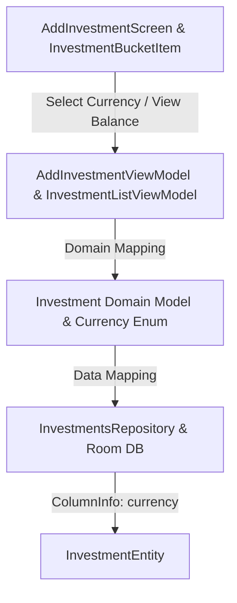

/# 🌐 Multi-Currency Support Plan (`USD` & `COP`) for Investment Section

## 📌 Executive Summary
This document outlines the step-by-step engineering plan to introduce first-class multi-currency support (`USD` and `COP`) into the **BookYouu Notes App** Investment module (`:investments`).

---

## 🏗️ Architectural Overview



---

## 🎯 Detailed Action Items

### Phase 1: Core Domain & Data Layer (`:investments` & `:db`)

#### 1. Define `Currency` Enum
Create a centralized `Currency` enum in `:investments` presentation/domain:
```kotlin
enum class Currency(
    val code: String,
    val symbol: String,
    @StringRes val titleResId: Int
) {
    USD("USD", "$", R.string.currency_usd),
    COP("COP", "$", R.string.currency_cop)
}
```

#### 2. Update Domain Model & Mappers
- Update `Investment` domain model:
  ```kotlin
  data class Investment(
      val id: Long = 0,
      val name: String,
      val type: InvestmentType,
      val initialAmount: Double,
      val currency: Currency = Currency.USD,
      val dateCreated: Long = System.currentTimeMillis()
  )
  ```
- Update `InvestmentMapper.kt`:
  - Convert `InvestmentEntity.currency` string safely to `Currency` (`Currency.valueOf(currency)` with fallback to `Currency.USD`).
  - Map `Currency` back to string code (`currency.code`) for Room persistence.

---

### Phase 2: Create Investment Flow (`AddInvestmentScreen`)

#### 1. Contract & State Update
- Update `AddInvestmentState` to include `selectedCurrency: Currency = Currency.USD`.
- Add action `data class OnCurrencyChange(val currency: Currency) : AddInvestmentAction`.

#### 2. UI Component (`CurrencySelector.kt`)
- Build a custom single-choice toggle control / segmented button component (`CurrencySelector.kt`) in `:investments:presentation:components`.
- Design: Clean pill options for **`USD ($)`** and **`COP ($)`** using project dark green theme accents.

#### 3. Update Form Layout
- Integrate `CurrencySelector` into `AddInvestmentScreen.kt` above/below amount input.

---

### Phase 3: Display & Formatting (`InvestmentBucketItem` & `InvestmentsPortfolioScreen`)

#### 1. Balance Formatting per Currency
- Format amounts based on currency rules:
  - **USD**: `$ 5,656 USD` or `$ 5,656`
  - **COP**: `$ 31,000,000 COP` or `$ 31.000.000` (optional thousand separator dot formatting for COP if desired)
- Update `InvestmentUi` to contain `currency: Currency` and `formattedBalance: String`.

#### 2. Net Worth Portfolio Aggregation (`NetWorthCard`)
- Since `USD` and `COP` cannot be blindly added 1:1 without exchange rates:
  - **Dual Net Worth Subtotals**: Display total breakdown by currency in `NetWorthCard`:
    - `USD Total`: `$ 5,656 USD`
    - `COP Total`: `$ 43,000,000 COP`
  - Keeps financial figures 100% accurate without requiring live network exchange rate API calls initially.

---

### Phase 4: Verification & Testing

1. **Unit Tests**:
   - Update `AddInvestmentViewModelTest` to verify currency state selection & saving.
   - Update `InvestmentListViewModelTest` to verify dual currency net worth formatting.
2. **Build Validation**:
   - Run `./gradlew :investments:test` and `./gradlew assembleDebug`.

---

## 📋 Implementation Checklist

- [x] Add string resources for `currency_usd` ("USD (Dólares)") and `currency_cop` ("COP (Pesos Colombianos)").
- [x] Create `Currency` enum & update `Investment` model mapping.
- [x] Create `CurrencySelector` composable.
- [x] Update `AddInvestmentScreen` & `AddInvestmentViewModel`.
- [x] Update `NetWorthCard` to render subtotals per currency (`USD` / `COP`).
- [x] Execute `./gradlew :investments:test`.
