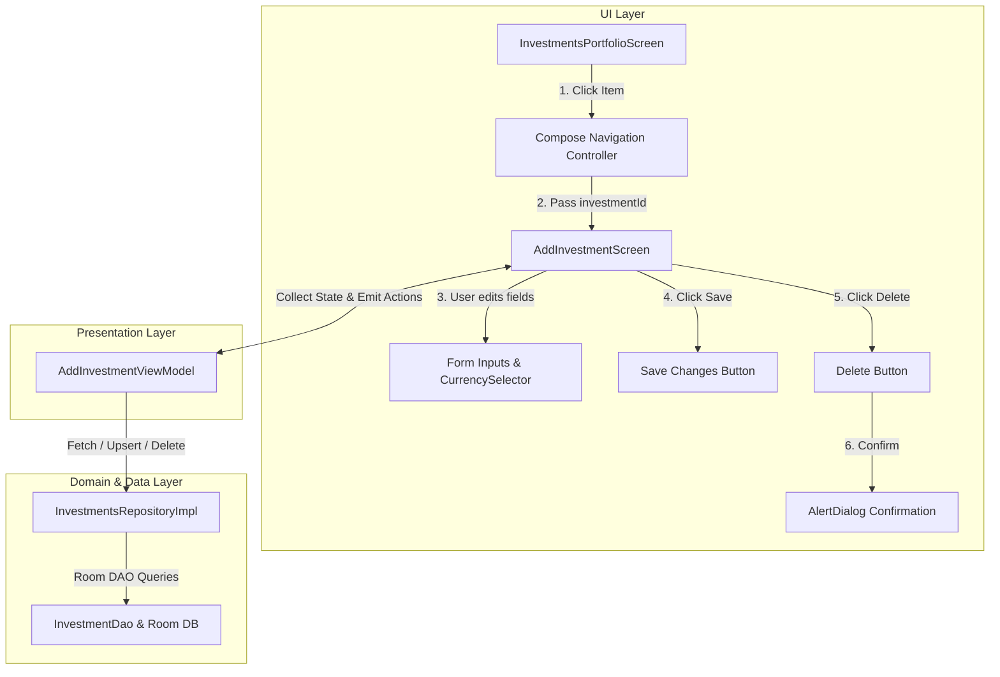

# ✏️ Detailed Edit & Delete Investment Feature Plan

## 📌 Executive Summary
This document specifies the technical architecture, UI/UX designs, state management, database contracts, and testing specifications required to implement **Editing and Deleting Existing Investments** within the **BookYouu Notes App** Investment module (`:investments`).

---

## 🏗️ Technical Architecture & Data Flow



---

## 🎯 Granular Specifications

### 1. Navigation Route & Argument Contract
- **Route Definition**:
  ```kotlin
  const val ADD_EDIT_INVESTMENT_ROUTE = "add_edit_investment?investmentId={investmentId}"
  ```
- **Arguments**:
  - `investmentId`: `NavType.LongType` (default `-1L`).
  - If `investmentId != -1L`, the screen opens in **Edit Mode**; otherwise, it opens in **Create Mode**.

---

### 2. State & Contract Definitions (`AddInvestmentContract.kt`)

#### Updated `AddInvestmentState`
```kotlin
data class AddInvestmentState(
    val investmentId: Long? = null,
    val isEditMode: Boolean = false,
    val amount: String = "0",
    val name: String = "",
    val selectedType: InvestmentType = InvestmentType.GENERAL,
    val selectedCurrency: Currency = Currency.USD,
    val term: String = "",
    val annualRevenue: String = "",
    val isLoading: Boolean = false,
    val showDeleteDialog: Boolean = false,
    val error: UiText? = null
)
```

#### New & Updated Actions (`AddInvestmentAction`)
- `data class LoadInvestment(val id: Long) : AddInvestmentAction`
- `object OnDeleteClick : AddInvestmentAction`
- `object OnConfirmDelete : AddInvestmentAction`
- `object OnDismissDeleteDialog : AddInvestmentAction`

---

### 3. Form Pre-Population Logic (`AddInvestmentViewModel.kt`)

When `LoadInvestment(id)` is dispatched:
1. Query repository via `repository.getInvestmentById(id).firstOrNull()`.
2. Populate `AddInvestmentState`:
   - `investmentId` = `investment.id`
   - `isEditMode` = `true`
   - `name` = `investment.name`
   - `amount` = `investment.initialAmount.toLong().toString()` (clean integer string without trailing `.0`)
   - `selectedType` = `investment.type`
   - `selectedCurrency` = `investment.currency`
   - `term` = `investment.termDays?.toString() ?: ""`
   - `annualRevenue` = `investment.annualRevenue?.toString() ?: ""`

When saving in **Edit Mode**:
- Preserve original `id` and `dateCreated` timestamp so Room DB's `@Upsert` updates the record instead of inserting a duplicate:
  ```kotlin
  val investment = Investment(
      id = currentState.investmentId ?: 0L,
      name = currentState.name,
      type = currentState.selectedType,
      initialAmount = currentState.amount.toDoubleOrNull() ?: 0.0,
      currency = currentState.selectedCurrency,
      dateCreated = existingDateCreated ?: System.currentTimeMillis()
  )
  ```

---

### 4. UI Specification (`AddInvestmentScreen.kt`)

1. **Top AppBar**:
   - Title: Displays `stringResource(R.string.edit_investment_title)` ("Edit Investment") when `isEditMode = true`, else `"New Investment"`.
2. **Primary Action Button**:
   - Text: `"Save Changes"` when `isEditMode = true`, else `"Create Investment"`.
3. **Delete Section**:
   - Rendered at the bottom of the form **only** when `isEditMode = true`.
   - Styled as an Outlined Button with `MaterialTheme.colorScheme.error` border and text.
4. **Delete Confirmation Dialog**:
   - `Title`: `"Delete Investment?"`
   - `Body`: `"Are you sure you want to delete '${state.name}'? This action cannot be undone."`
   - `Confirm Button`: `"Delete"` (Destructive container color)
   - `Dismiss Button`: `"Cancel"`

---

### 5. String Resources (`strings.xml` & `values-es/strings.xml`)

| Key | English (`strings.xml`) | Spanish (`values-es/strings.xml`) |
| :--- | :--- | :--- |
| `edit_investment_title` | `"Edit Investment"` | `"Editar inversión"` |
| `edit_investment_button_save` | `"Save Changes"` | `"Guardar cambios"` |
| `delete_investment_button` | `"Delete Investment"` | `"Eliminar inversión"` |
| `delete_investment_dialog_title` | `"Delete Investment?"` | `"¿Eliminar inversión?"` |
| `delete_investment_dialog_body` | `"Are you sure you want to delete \'%1$s\'? This action cannot be undone."` | `"¿Estás seguro de que deseas eliminar \'%1$s\'? Esta acción no se puede deshacer."` |
| `delete_investment_confirm` | `"Delete"` | `"Eliminar"` |
| `cancel` | `"Cancel"` | `"Cancelar"` |

---

### 6. Testing Strategy & Test Specifications

#### Unit Tests (`AddInvestmentViewModelTest.kt`)
1. **`loadInvestment_populatesStateForExistingInvestment`**:
   - Verify all form fields match the existing model.
   - Verify `isEditMode == true`.
2. **`saveInvestment_inEditMode_updatesExistingRecord`**:
   - Verify `repository.upsertInvestment` receives the original `id`.
3. **`deleteInvestment_showsDialog_andDeletesOnConfirm`**:
   - Verify `OnDeleteClick` sets `showDeleteDialog = true`.
   - Verify `OnConfirmDelete` calls `repository.deleteInvestment` and emits `InvestmentCreated` / `InvestmentDeleted` event to navigate back.

---

## 📋 Implementation Checklist

- [ ] Add string resources for edit and delete titles/dialogs in English & Spanish.
- [ ] Add `LoadInvestment`, `OnDeleteClick`, `OnConfirmDelete`, `OnDismissDeleteDialog` to `AddInvestmentContract`.
- [ ] Update `AddInvestmentViewModel` to support `LoadInvestment` pre-population and `deleteInvestment`.
- [ ] Update `AddInvestmentScreen` with dynamic title, primary button text, Delete button, and confirmation `AlertDialog`.
- [ ] Wire navigation in `:app` and `InvestmentsPortfolioScreen` to pass `investmentId`.
- [ ] Write unit tests in `AddInvestmentViewModelTest`.
- [ ] Execute `./gradlew :investments:test` and `./gradlew assembleDebug`.
