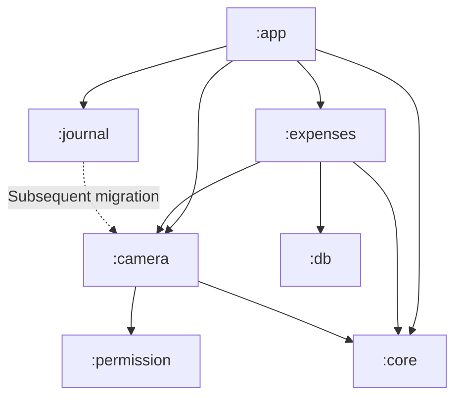
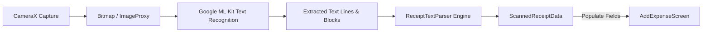

# SDD: Independent Camera Module & Expense Receipt OCR Extraction Plan

This document outlines the technical design, architectural specification, and phased implementation steps for creating an **independent `:camera` module** in the BookYouu app and integrating it with the **`:expenses`** section to automatically extract **Merchant/Product**, **Total Price**, and **Date** from physical receipts and invoices.

---

## 📌 Confirmed Requirements & Architectural Goals

1. **Independent Camera Module (`:camera`):**
   - A dedicated, standalone Android library module housing CameraX capture pipelines and OCR processing.
   - Designed to serve as the unified camera module for the entire application (paving the way to deprecate and migrate legacy camera code from `:core` in a subsequent phase).
2. **Receipt Focus (Store Invoices, Totals & Dates):**
   - Focused on scanning **full merchant receipts/invoices**.
   - **Product/Merchant (`description`):** Identifies store or company name from the receipt header (e.g., "Éxito", "Walmart", "Starbucks", "Farmatodo").
   - **Price (`amount`):** Identifies grand total or final amount paid ("TOTAL", "TOTAL A PAGAR", "VALOR", "IMPORTE"), properly handling currency symbols and thousand/decimal separators.
   - **Date (`selectedDate`):** Detects transaction/issue date in various formats (`dd/MM/yyyy`, `yyyy-MM-dd`, `dd-MMM-yyyy`), supporting Spanish and English month names.
3. **Dedicated Full-Screen Route Navigation:**
   - Triggered from `AddExpenseScreen` via a camera scan icon.
   - Navigates to a dedicated full-screen destination: `Route.EXPENSE_CAMERA_SCAN`.
   - On capture and analysis completion, navigates back to `AddExpenseScreen` with fields pre-filled for user review before saving.

---

## 🏗️ Multi-Module Architecture

### Module Dependencies



### Module Responsibilities:
- **`:camera` (New Module):**
  - **Data:** CameraX implementation (`ProcessCameraProvider`, `ImageCapture`, `ImageAnalysis`), Google ML Kit Text Recognition (`com.google.android.gms:play-services-mlkit-text-recognition`).
  - **Domain:** `ScannedReceiptData`, `ReceiptOcrEngine`, `ReceiptTextParser`, `ScanReceiptUseCase`.
  - **Presentation:** `CameraScannerScreen`, viewfinder target frame with rounded corners, torch toggle, shutter button, processing indicators.
- **`:expenses`:**
  - Adds camera action button to `AddExpenseScreen`.
  - Consumes `ScannedReceiptData` and populates `amount`, `description`, and `selectedDate`.
- **`:permission`:**
  - Handles `Manifest.permission.CAMERA` via `RequireCameraPermission`.

---

## 🔍 Receipt Data Extraction Pipeline



### 1. Extracted Domain Model
```kotlin
package com.kalex.bookyouu_notesapp.camera.domain.model

import java.time.LocalDate

data class ScannedReceiptData(
    val merchantName: String?,
    val totalAmount: Double?,
    val date: LocalDate?,
    val rawText: String,
    val confidence: Float = 1.0f
)
```

### 2. Receipt Parsing Heuristics & Rules

| Field | Extraction Strategy | Rules & Fallbacks |
| :--- | :--- | :--- |
| **Merchant / Store (`description`)** | Scan top 1–4 lines of recognized text (header area). | Filter out noise words like `"FACTURA"`, `"NIT"`, `"RUT"`, `"TICKET"`, `"SIMPLIFICADO"`, `"RUC"`, `"TEL"`, `"DIR"`, `"CAJA"`. Take the first prominent text line as merchant name (max 50 chars). |
| **Total Price (`amount`)** | Regex matching total keywords followed by amount:<br>`(?i)(?:total|total\s+a\s+pagar|valor|importe|neto|pagar|bal|due)[\s:]*[$€£]?\s*([0-9]{1,3}(?:[.,][0-9]{3})*(?:[.,][0-9]{2})?)` | If keyword total is not found, extract the highest valid monetary number appearing in the bottom half of the receipt (ignoring tax rates and phone numbers). Handles both Colombian dot-thousands (`$12.500`) and decimal formats (`$12.50`). |
| **Date (`selectedDate`)** | Regex for standard receipt dates:<br>1. `\b(\d{1,2})[-/.](\d{1,2})[-/.](\d{2,4})\b`<br>2. `\b(\d{1,2})\s+(?:de\s+)?(ene|feb|mar|abr|may|jun|jul|ago|sep|oct|nov|dic|[a-z]{3,9})\.?\s+(?:del?\s+)?(\d{2,4})\b` | Validates that year is between 2000 and current year + 1 month. Defaults to `LocalDate.now()` if undetectable. |

---

## 📅 Phased Implementation Plan

### Phase 1: Module Creation & Build Setup (`:camera`) - [COMPLETED]
1. Created independent `:camera` library module in the project root.
2. Registered `:camera` in [settings.gradle](file:///Users/kalex/Desktop/BookYouu-notesApp/settings.gradle).
3. Added bundled ML Kit Text Recognition to [libs.versions.toml](file:///Users/kalex/Desktop/BookYouu-notesApp/gradle/libs.versions.toml):
   ```toml
   [versions]
   mlkit-text-recognition = "16.0.1"

   [libraries]
   mlkit-text-recognition = { module = "com.google.mlkit:text-recognition", version.ref = "mlkit-text-recognition" }
   ```
4. Configured [camera/build.gradle.kts](file:///Users/kalex/Desktop/BookYouu-notesApp/camera/build.gradle.kts):
   - Plugins: `com.android.library`, `org.jetbrains.kotlin.android`, `kotlin.compose`.
   - CameraX: `androidx-camera-camera2`, `androidx-camera-lifecycle`, `androidx-camera-view`, `androidx-camera-extensions`.
   - Bundled ML Kit Text Recognition: `mlkit-text-recognition` (100% on-device, zero Play Services dependency).
   - Project dependencies: `:core`, `:permission`.
5. Created [camera/src/main/AndroidManifest.xml](file:///Users/kalex/Desktop/BookYouu-notesApp/camera/src/main/AndroidManifest.xml), [camera/consumer-rules.pro](file:///Users/kalex/Desktop/BookYouu-notesApp/camera/consumer-rules.pro), and [camera/proguard-rules.pro](file:///Users/kalex/Desktop/BookYouu-notesApp/camera/proguard-rules.pro).
6. Verified configuration and build with `./gradlew :camera:assembleDebug` (Build Successful).

### Phase 2: Domain Layer (`:camera:domain`) - [COMPLETED]
1. **Domain Model:**
   - [`ScannedReceiptData.kt`](file:///Users/kalex/Desktop/BookYouu-notesApp/camera/src/main/java/com/kalex/bookyouu_notesapp/camera/domain/model/ScannedReceiptData.kt): Models `merchantName`, `totalAmount`, `date`, `rawText`, and `confidence`.
2. **Contracts & Interfaces:**
   - [`ReceiptOcrEngine.kt`](file:///Users/kalex/Desktop/BookYouu-notesApp/camera/src/main/java/com/kalex/bookyouu_notesapp/camera/domain/engine/ReceiptOcrEngine.kt): Interface for OCR text recognition from `Bitmap`.
   - [`ReceiptTextParser.kt`](file:///Users/kalex/Desktop/BookYouu-notesApp/camera/src/main/java/com/kalex/bookyouu_notesapp/camera/domain/parser/ReceiptTextParser.kt): Interface for converting raw OCR text into `ScannedReceiptData`.
3. **Use Case:**
   - [`ScanReceiptUseCase.kt`](file:///Users/kalex/Desktop/BookYouu-notesApp/camera/src/main/java/com/kalex/bookyouu_notesapp/camera/domain/usecase/ScanReceiptUseCase.kt): Orchestrates OCR engine and parser pipeline returning `Result<ScannedReceiptData>`.
4. **Unit Tests:**
   - [`ScanReceiptUseCaseTest.kt`](file:///Users/kalex/Desktop/BookYouu-notesApp/camera/src/test/java/com/kalex/bookyouu_notesapp/camera/domain/usecase/ScanReceiptUseCaseTest.kt): Verified with `./gradlew :camera:testDebugUnitTest` (All tests passing).

### Phase 3: Data Layer (`:camera:data`) - [COMPLETED]
1. **`MlKitReceiptOcrEngine.kt`:**
   - Implemented [`MlKitReceiptOcrEngine.kt`](file:///Users/kalex/Desktop/BookYouu-notesApp/camera/src/main/java/com/kalex/bookyouu_notesapp/camera/data/engine/MlKitReceiptOcrEngine.kt) wrapping `TextRecognizer` via Kotlin Coroutines (`suspendCancellableCoroutine`).
2. **`RegexReceiptTextParser.kt`:**
   - Implemented [`RegexReceiptTextParser.kt`](file:///Users/kalex/Desktop/BookYouu-notesApp/camera/src/main/java/com/kalex/bookyouu_notesapp/camera/data/parser/RegexReceiptTextParser.kt) with heuristic extraction for:
     - **Merchant name:** Discards tax/legal noise (`NIT`, `DIAN`, `FACTURA`, `CAJA`, `TEL`) and cleans formatting.
     - **Total amount:** High-priority phrase detection (`TOTAL A PAGAR`, `VALOR TOTAL`), standard keywords, subtotal/tip exclusion, and fallback to largest monetary value. Robust thousand (`$12.500`) and decimal (`$12.50`) parsing.
     - **Date:** Handles ISO (`YYYY-MM-DD`), Latin (`DD/MM/YYYY`), and alphanumeric month formats (`15 de Octubre de 2026`).
3. **Unit Tests:**
   - Implemented [`RegexReceiptTextParserTest.kt`](file:///Users/kalex/Desktop/BookYouu-notesApp/camera/src/test/java/com/kalex/bookyouu_notesapp/camera/data/parser/RegexReceiptTextParserTest.kt) testing Colombian receipts, US receipts, Spanish restaurant bills, subtotal/tip separation, fallback numbers, and numeric formatting.
   - All tests passing verified with `./gradlew :camera:testDebugUnitTest`.

### Phase 4: Presentation Layer (`:camera:presentation`) - [COMPLETED]
1. **`CameraScannerContract.kt`:**
   - Implemented [`CameraScannerContract.kt`](file:///Users/kalex/Desktop/BookYouu-notesApp/camera/src/main/java/com/kalex/bookyouu_notesapp/camera/presentation/CameraScannerContract.kt) with `CameraScannerState`, `CameraScannerAction`, and `CameraScannerEvent`.
2. **`CameraScannerViewModel.kt`:**
   - Implemented [`CameraScannerViewModel.kt`](file:///Users/kalex/Desktop/BookYouu-notesApp/camera/src/main/java/com/kalex/bookyouu_notesapp/camera/presentation/CameraScannerViewModel.kt) managing in-memory photo processing, gallery image picking via `ImageDecoder`, and OCR orchestration.
3. **`CameraScannerScreen.kt`:**
   - Implemented [`CameraScannerScreen.kt`](file:///Users/kalex/Desktop/BookYouu-notesApp/camera/src/main/java/com/kalex/bookyouu_notesapp/camera/presentation/CameraScannerScreen.kt) with:
     - Integration with `:permission`'s `RequireCameraPermission`.
     - Full-screen CameraX live preview with touch controls.
     - Custom viewfinder cutout with dark transparent scrim, dark green border (`#004D40`), and animated laser scanning line.
     - Controls: Shutter button with circular progress indicator, gallery image picker button, flash/torch toggle, and close button.
4. **Strings & Localization:**
   - Added English and Spanish strings to [camera/src/main/res/values/strings.xml](file:///Users/kalex/Desktop/BookYouu-notesApp/camera/src/main/res/values/strings.xml) and [camera/src/main/res/values-es/strings.xml](file:///Users/kalex/Desktop/BookYouu-notesApp/camera/src/main/res/values-es/strings.xml).
5. **Dependency Injection:**
   - Implemented [`CameraModule.kt`](file:///Users/kalex/Desktop/BookYouu-notesApp/camera/src/main/java/com/kalex/bookyouu_notesapp/camera/di/CameraModule.kt).
6. **Compilation Verification:**
   - Assembled cleanly with `./gradlew :camera:assembleDebug`.

### Phase 5: Navigation & `:expenses` Integration
1. **Add `:camera` to `expenses/build.gradle.kts`:**
   ```kotlin
   implementation(project(":camera"))
   ```
2. **Navigation Route (`Route.kt` in `:app`):**
   - Add `const val EXPENSE_CAMERA_SCAN = "expense_camera_scan"`.
3. **Navigation Graph (`expensesNavigationGraph.kt`):**
   - Add composable destination `Route.EXPENSE_CAMERA_SCAN`.
   - On scan success, set `scanned_receipt` in `navController.previousBackStackEntry?.savedStateHandle` and call `navController.popBackStack()`.
4. **Trigger & Auto-population in `AddExpenseScreen.kt`:**
   - Add camera icon button in the TopAppBar and next to the Amount input field.
   - Observe `savedStateHandle` in `AddExpenseRoot`:
     - Sets `amount` to formatted `totalAmount`.
     - Sets `description` to `merchantName`.
     - Updates `selectedDate` to detected `date`.
   - Display a brief snackbar: *"Receipt scanned! Please review before saving."*

### Phase 6: Koin Dependency Injection & Localization
1. **`CameraModule.kt` (`:camera:di`):**
   ```kotlin
   val cameraModule = module {
       single<TextRecognizer> { TextRecognition.getClient(TextRecognizerOptions.DEFAULT_OPTIONS) }
       single<ReceiptOcrEngine> { MlKitReceiptOcrEngine(get()) }
       single<ReceiptTextParser> { RegexReceiptTextParser() }
       single { ScanReceiptUseCase(get(), get()) }
       viewModelOf(::CameraScannerViewModel)
   }
   ```
2. **Register in `MainApplication.kt`:** Add `cameraModule` to Koin initialization.
3. **Localization (`strings.xml` in ES and EN):**
   - Add UI strings: "Scan Receipt", "Align receipt within frame", "Processing receipt...", "Could not detect receipt details. Enter manually.", etc.

### Phase 7: Testing & Future Unification
1. **Unit Tests:**
   - `RegexReceiptTextParserTest`: Verify extraction across 15+ real-world receipt text samples (store names, varying date formats, amounts with commas/dots).
   - `ScanReceiptUseCaseTest`: Test pipeline with mock OCR results.
   - `ExpenseViewModelTest`: Test that receiving scanned receipt values updates UI state seamlessly.
2. **Subsequent Unified Camera Migration (Future Phase):**
   - Migrate `:journal`'s photo capture from `:core:camera` to `:camera`.
   - Deprecate `:core:camera` to ensure single-responsibility and eliminate duplicate camera dependencies.
