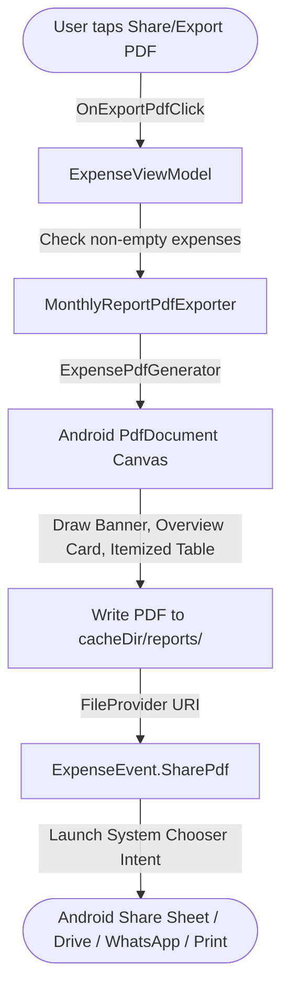

# SDD: Monthly Expense PDF Generation & Export Plan

This document details the architecture and implementation design for the **Monthly Expense PDF Generation & Export** feature in BookYouu.

This feature operates **100% on-device** using the native Android `PdfDocument` framework. It produces clean, beautifully formatted financial summaries with zero external cloud dependencies, zero external SDK bloat, full offline capability, and complete user privacy.

---

## 🏛️ System Architecture

- **Execution Model:** 100% On-Device. No cloud servers, no third-party PDF services, no privacy risks.
- **PDF Generation Engine:** Native Android [`PdfDocument`](file:///Users/kalex/Desktop/BookYouu-notesApp/expenses/src/main/java/com/kalex/bookyouu_notesapp/expenses/presentation/pdf/ExpensePdfGenerator.kt) via [`android.graphics.pdf.PdfDocument`](https://developer.android.com/reference/android/graphics/pdf/PdfDocument).
- **File Sharing Pipeline:** Internal app cache storage (`cacheDir/reports/`) + secure [`FileProvider`](file:///Users/kalex/Desktop/BookYouu-notesApp/expenses/src/main/AndroidManifest.xml) URI generation + Android System Share Sheet (`Intent.ACTION_SEND` with `application/pdf`).
- **Architecture Pattern:** MVI (Model-View-Intent) + Clean Architecture within the `:expenses` module.

---

## 📄 PDF Document Layout & Styling

Consistent with BookYouu's brand identity:
- **Primary Color:** `#004D40` (Dark Green Header & Accent Borders)
- **Backgrounds:** Clean White (`#FFFFFF`) with Alternating Rows (`#F8FAFC`) and Table Header (`#ECEFF1`)
- **Typography:** Android Native Scalable Typefaces with bold weights for metrics and totals
- **Paper Size:** Standard A4 (595pt x 842pt)

### Document Sections:
1. **Branded Header Banner:**
   - App title ("BookYouu Notes App") and subtitle ("Monthly Expense Report • MM-YYYY").
   - Generation timestamp formatted to local device date.
2. **Financial Overview Card:**
   - Total Amount Spent for the selected month.
   - Total Transactions count.
   - Distinct dividing borders.
3. **Itemized Expense Ledger:**
   - Table Columns: `Date` | `Category` | `Description` | `Amount`.
   - Category display formatted from enum.
   - Truncated descriptions preventing canvas overflow.
   - Bold amount strings highlighted in primary green.
4. **Dynamic Pagination & Footers:**
   - Automatic page breaks when row count exceeds page height limit (`pageHeight - 60`).
   - Repeating table headers on subsequent pages.
   - Page numbering footer (`Page X`) with privacy attribution note.

---

## 🧱 Component Breakdown

### 1. Presentation Interface & Implementation (`:expenses:presentation:pdf`)
- [`MonthlyReportPdfExporter`](file:///Users/kalex/Desktop/BookYouu-notesApp/expenses/src/main/java/com/kalex/bookyouu_notesapp/expenses/presentation/pdf/MonthlyReportPdfExporter.kt): Interface defining the export contract.
- [`ExpensePdfGenerator`](file:///Users/kalex/Desktop/BookYouu-notesApp/expenses/src/main/java/com/kalex/bookyouu_notesapp/expenses/presentation/pdf/ExpensePdfGenerator.kt): Concrete implementation handling `Canvas` rendering, file writing, and `FileProvider` URI packaging.

### 2. Provider Configuration (`:expenses:res:xml`)
- [`file_paths.xml`](file:///Users/kalex/Desktop/BookYouu-notesApp/expenses/src/main/res/xml/file_paths.xml): Configured `<cache-path name="reports" path="reports/" />`.
- [`AndroidManifest.xml`](file:///Users/kalex/Desktop/BookYouu-notesApp/expenses/src/main/AndroidManifest.xml): Registered `androidx.core.content.FileProvider` with authority `${applicationId}.expenses.fileprovider`.

### 3. State & Intent Wiring (`:expenses:presentation`)
- [`ExpenseContract.kt`](file:///Users/kalex/Desktop/BookYouu-notesApp/expenses/src/main/java/com/kalex/bookyouu_notesapp/expenses/presentation/ExpenseContract.kt):
  - `ExpenseState.isExportingPdf`: Controls loading indicator in top bar.
  - `ExpenseAction.OnExportPdfClick`: Triggers PDF generation flow.
  - `ExpenseEvent.SharePdf(uri: Uri, title: String)`: Dispatches share intent.
- [`ExpenseViewModel.kt`](file:///Users/kalex/Desktop/BookYouu-notesApp/expenses/src/main/java/com/kalex/bookyouu_notesapp/expenses/presentation/ExpenseViewModel.kt):
  - Coordinates PDF export in `viewModelScope`.
  - Dispatches `SharePdf` event or feedback snackbar when no expenses exist.
- [`ExpenseListScreen.kt`](file:///Users/kalex/Desktop/BookYouu-notesApp/expenses/src/main/java/com/kalex/bookyouu_notesapp/expenses/presentation/ExpenseListScreen.kt):
  - Export action icon in top bar with progress spinner during rendering.
  - Subscribes to `ExpenseEvent.SharePdf` to display Android system share sheet.

---

## 🧪 Testing Strategy

1. **Unit Testing (`:expenses:test`):**
   - [`ExpenseViewModelTest`](file:///Users/kalex/Desktop/BookYouu-notesApp/expenses/src/test/java/com/kalex/bookyouu_notesapp/expenses/presentation/ExpenseViewModelTest.kt):
     - `when onExportPdfClick is triggered with expenses, pdfExporter is called`.
     - `when onExportPdfClick is triggered without expenses, pdfExporter is not called`.
     - Repository deletions, month navigation, and state consistency.
   - [`FakeMonthlyReportPdfExporter`](file:///Users/kalex/Desktop/BookYouu-notesApp/expenses/src/test/java/com/kalex/bookyouu_notesapp/expenses/presentation/pdf/FakeMonthlyReportPdfExporter.kt):
     - Mock exporter verifying call count and parameters without needing native Android Canvas during JVM unit tests.
