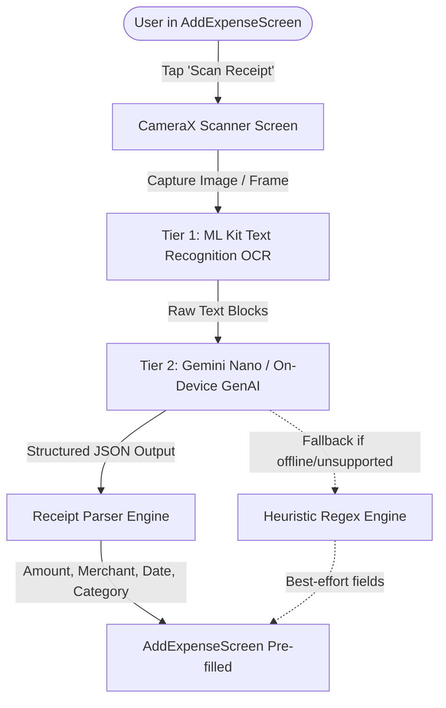

# SDD: Camera Receipt Scanner & Gen AI Expense Recognition

This document outlines the technical design and phased implementation steps for the **Camera Receipt Scanner & Gen AI Expense Recognition** feature in the BookYouu app. This feature enables users to snap a photo or scan a receipt using their device camera, extract the text using **Google ML Kit Text Recognition**, and parse key financial fields (Total, Merchant, Category, and Date) via **Google On-Device Generative AI (Gemini Nano / Google AI Edge)** to auto-populate the `AddExpenseScreen`.

---

## 🏗️ Architecture & 2-Tier AI Pipeline

To deliver optimal speed (<250ms), battery efficiency, and 100% offline capability without bloating APK size, a **2-Tier Hybrid AI Pipeline** is employed:



1. **Tier 1 (Fast On-Device OCR - Google ML Kit):**
   - Uses `play-services-mlkit-text-recognition`.
   - Runs locally in milliseconds with hardware acceleration.
   - Extracts all text lines and bounding boxes from the physical receipt.
2. **Tier 2 (Semantic Understanding - Gen AI / Gemini Nano):**
   - Parses chaotic receipt layouts (taxes, itemized lists, tips, subtotals, dates).
   - Classifies the merchant into one of BookYouu's predefined `Category` types (`FOOD`, `TRANSPORT`, `SHOPPING`, `HEALTH`, etc.).
   - Extracts the accurate final Grand Total (distinguishing from subtotal and taxes).
3. **Graceful Fallback (Heuristic Regex):**
   - If Gen AI is unavailable or the device model is initializing, fallback regex patterns extract the highest currency amount and date formats.

---

## 📅 Phase 1: Dependencies & Permissions (`:expenses` & `:permission`)

1. **Gradle Dependencies (`libs.versions.toml`):**
   ```toml
   [libraries]
   play-services-mlkit-text-recognition = { module = "com.google.android.gms:play-services-mlkit-text-recognition", version = "19.0.1" }
   ```
2. **Module Build File (`expenses/build.gradle.kts`):**
   - Add `implementation(libs.play.services.mlkit.text.recognition)`.
   - Add `implementation(libs.androidx.camera.camera2)`.
   - Add `implementation(libs.androidx.camera.lifecycle)`.
   - Add `implementation(libs.androidx.camera.view)`.
   - Add `implementation(project(":permission"))`.
3. **Permissions:**
   - Use `:permission` module's existing `RequireCameraPermission`.

---

## 🏛️ Phase 2: Domain Layer (`:expenses:domain`)
*Goal: Model parsed receipts and business use cases.*

1. **Domain Models (`:expenses:domain:model`):**
   - **`ScannedReceipt.kt`:**
     ```kotlin
     data class ScannedReceipt(
         val amount: Double?,
         val merchantName: String?,
         val date: LocalDate?,
         val category: Category,
         val rawText: String,
         val confidenceScore: Float = 1.0f
     )
     ```

2. **Repository & Service Contracts (`:expenses:domain:repository`):**
   - **`ReceiptScannerRepository.kt`:**
     ```kotlin
     interface ReceiptScannerRepository {
         suspend fun scanReceiptText(imageBitmap: Bitmap): Result<String>
         suspend fun parseReceiptWithAi(rawOcrText: String): Result<ScannedReceipt>
     }
     ```

3. **Use Cases (`:expenses:domain:usecase`):**
   - **`ScanAndExtractReceiptUseCase.kt`:**
     - Orchestrates Tier 1 (ML Kit OCR) and Tier 2 (Gen AI extraction).
     - Returns `ScannedReceipt` with clean pre-filled values.

---

## 🤖 Phase 3: Data Layer & AI Parser Implementation (`:expenses:data`)
*Goal: Integrate ML Kit Text Recognition and Gen AI prompt parsing.*

1. **ML Kit Vision Recognizer (`MlKitReceiptScanner.kt`):**
   ```kotlin
   class MlKitReceiptScanner(private val textRecognizer: TextRecognizer) {
       suspend fun recognizeText(bitmap: Bitmap): String = suspendCancellableCoroutine { continuation ->
           val image = InputImage.fromBitmap(bitmap, 0)
           textRecognizer.process(image)
               .addOnSuccessListener { text -> continuation.resume(text.text) }
               .addOnFailureListener { error -> continuation.resumeWithException(error) }
       }
   }
   ```

2. **Gen AI Semantic Extractor (`ReceiptGenAiParser.kt`):**
   - Prompt format sent to on-device Gemini Nano:
     ```text
     You are a financial receipt parser. Extract the structured expense data from this receipt text.
     
     Available Categories:
     FOOD, HEALTH, EDUCATION, ENTERTAINMENT, TRANSPORT, HOME, SHOPPING, GYM, SUBSCRIPTION, UTILITY, GENERAL, OTHERS
     
     Receipt Text:
     """
     {rawOcrText}
     """
     
     Output ONLY a valid JSON object with the following fields:
     {
       "amount": double (the grand total paid, e.g. 24.50),
       "merchant": string (business/store name, e.g. "Walmart"),
       "date": string (ISO date "YYYY-MM-DD" if present, otherwise null),
       "category": string (must match one of the available categories)
     }
     ```
   - Maps the returned `category` string using `Category.fromName(name)`.

3. **Heuristic Fallback Engine (`HeuristicReceiptFallback.kt`):**
   - Regex patterns for currency totals: `(Total|Amount Due|Total USD|Total Due)[:\s]*[$€£]?\s*([0-9]+[.,][0-9]{2})`.
   - Date regex: `\b(\d{1,2})[-/.](\d{1,2})[-/.](\d{2,4})\b`.

---

## ⚡ Phase 4: Presentation Layer (`:expenses:presentation`)
*Goal: Camera UI, scanner flow, and AddExpense integration.*

1. **State Machine (`ExpenseContract.kt`):**
   - **`AddExpenseState` additions:**
     ```kotlin
     val isScanningReceipt: Boolean = false,
     val scanProgressMessage: UiText? = null,
     val scanError: UiText? = null
     ```
   - **`ExpenseAction` additions:**
     - `OnScanReceiptClick`
     - `OnReceiptImageCaptured(bitmap: Bitmap)`
     - `OnCancelReceiptScan`
   - **`ExpenseEvent` additions:**
     - `ReceiptScanSuccess(receipt: ScannedReceipt)`

2. **Camera Scanner Screen (`ReceiptScannerScreen.kt`):**
   - Wrapped with `RequireCameraPermission`.
   - **CameraX Preview:** With a rounded translucent target rectangle overlay to help the user align the receipt.
   - **Action Bar:**
     - Flashlight toggle.
     - Gallery picker button (`rememberLauncherForActivityResult(GetContent)`).
     - Shutter button with haptic feedback.
   - **Scanning Overlay:**
     - Animated scanning laser/bar during ML Kit & Gen AI processing.
     - Live status text: *"Reading receipt text..."* ➔ *"Extracting expense with AI..."*.

---

## 🎨 Phase 5: AddExpenseScreen Integration
*Goal: Seamless user handoff into the expense form.*

1. **Trigger Button in `AddExpenseScreen`:**
   - Add a camera icon button next to the amount input or in the top app bar:
     - Icon: `Icons.Default.CameraAlt` or `PhotoCamera`.
     - Tooltip: "Scan Receipt with AI".
2. **Auto-Populate Fields:**
   - When `ReceiptScanSuccess` triggers:
     - `amount` ➔ set to formatted amount (e.g. `45.90`).
     - `description` ➔ set to `merchantName` (e.g. `"Starbucks"`).
     - `selectedCategory` ➔ auto-selects `Category.FOOD`.
     - `selectedDate` ➔ set to receipt date if detected.
   - Show a subtle confirmation snackbar: *"Receipt scanned! Review details before saving."*
3. User retains full control to edit any field before tapping Save.

---

## 🔗 Phase 6: Dependency Injection & Localization

1. **Koin Integration (`ExpensesModule.kt`):**
   ```kotlin
   single<TextRecognizer> { TextRecognition.getClient(TextRecognizerOptions.DEFAULT_OPTIONS) }
   single { MlKitReceiptScanner(get()) }
   single { ReceiptGenAiParser(get()) }
   single<ReceiptScannerRepository> { ReceiptScannerRepositoryImpl(get(), get(), get()) }
   factory { ScanAndExtractReceiptUseCase(get()) }
   ```

2. **Localization (`strings.xml` in ES and EN):**
   - `scan_receipt_title`: "Scan Receipt" / "Escanear Recibo"
   - `scan_receipt_hint`: "Align receipt within the frame" / "Alinea el recibo dentro del marco"
   - `scan_processing_ocr`: "Reading text..." / "Leyendo texto..."
   - `scan_processing_ai`: "Extracting details with Gen AI..." / "Extrayendo detalles con IA..."
   - `scan_success_snackbar`: "Receipt scanned! Please review before saving." / "¡Recibo escaneado! Revisa antes de guardar."
   - `scan_error_unreadable`: "Could not read receipt. Please enter manually." / "No se pudo leer el recibo. Ingrésalo manualmente."

---

## 🧪 Phase 7: Testing & Quality Assurance

1. **Unit Tests:**
   - `ReceiptGenAiParserTest`: Test JSON parsing from varied Gen AI responses (clean JSON, markdown-wrapped JSON, partial JSON).
   - `HeuristicReceiptFallbackTest`: Test regex extraction against noisy OCR text samples.
   - `ScanAndExtractReceiptUseCaseTest`: Verify complete pipeline orchestration with mocked OCR and AI.
2. **Edge Cases to Test:**
   - Crumpled, low-light, or skewed receipts.
   - Receipts with multiple numbers (tips, subtotal, sales tax, total).
   - Foreign currencies or receipts without dates.
   - Offline handling when on-device LLM is uninitialized.
